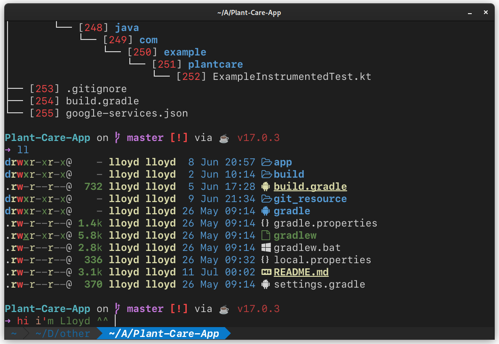
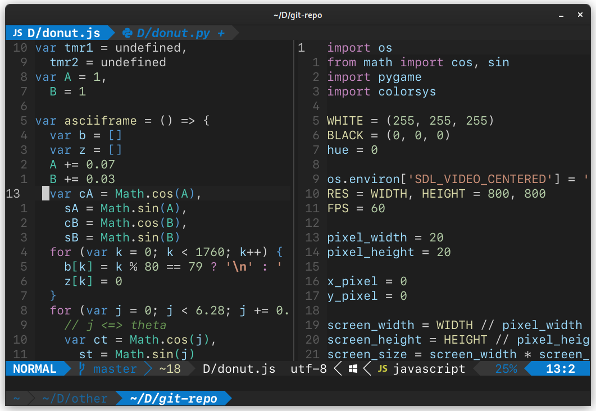
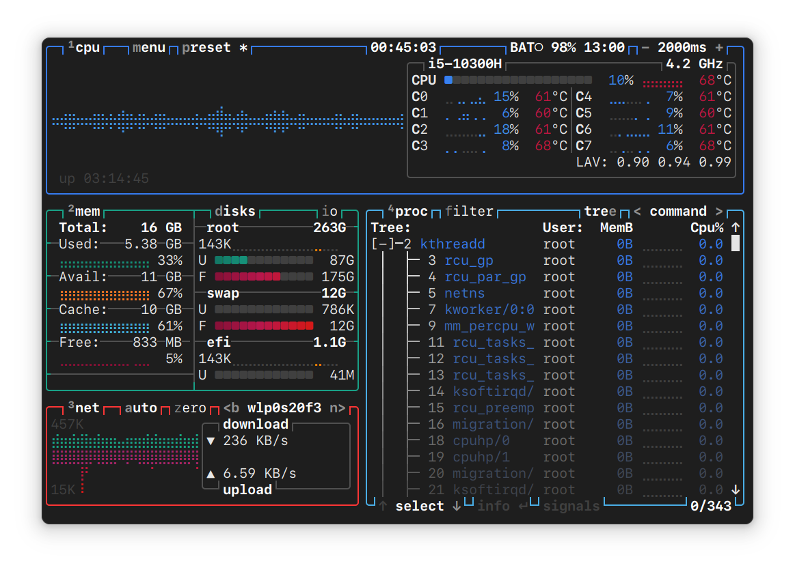
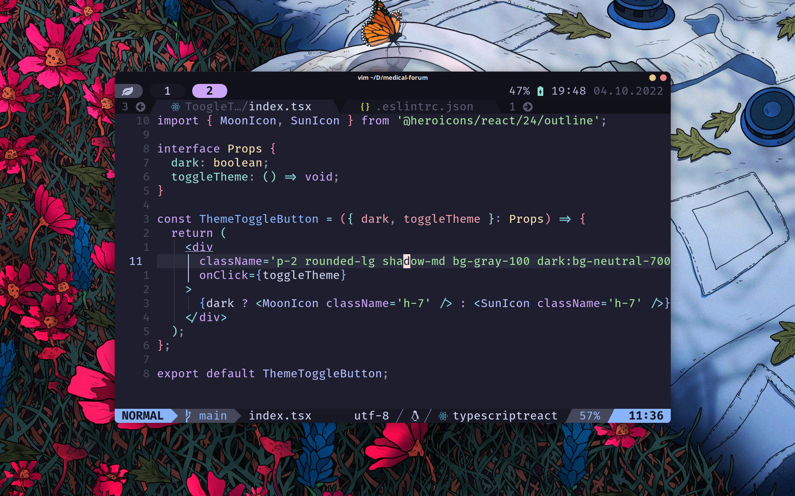
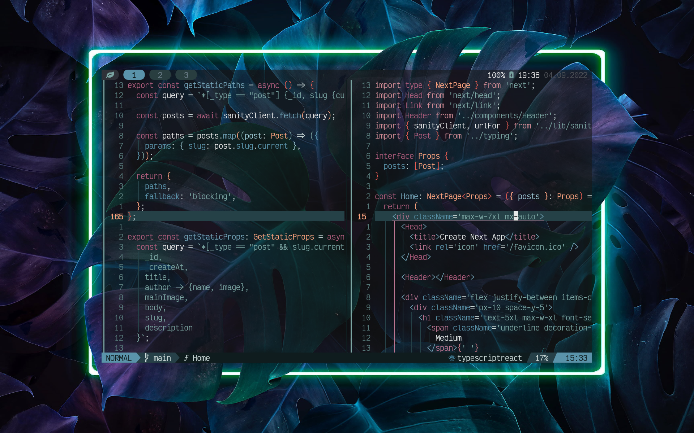

# My Dotfiles

**My configurations for neovim, kitty terminal and fish shell.**

## Preview

## Showcase

	
catppuccin

 

	
terafox

## Tools

- [neovim nightly](https://github.com/neovim/neovim) - the best code editor
- [kitty](https://github.com/kovidgoyal/kitty) - features rich terminal emulator
- [black box](https://flathub.org/apps/details/com.raggesilver.BlackBox) - modern gtk4 terminal
- [fish shell](https://github.com/neovim/neovim) - smart and user-friendly command line
  shell
- [starship](https://github.com/neovim/neovim) - beautiful prompt
- [thefuck](https://github.com/nvbn/thefuck) - simple command to correct error in terminal
- [z for fish](https://github.com/jethrokuan/z) - command to jump between directories
- [fzf](https://github.com/junegunn/fzf) - fuzzy finder
- [btop](https://github.com/aristocratos/btop) - monitor of resourses
